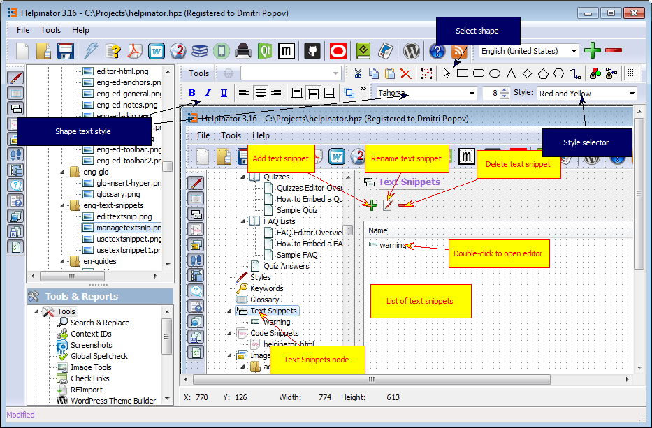

You can add callouts and annotations to the images stored in the image library. Select an image and click "Tools->Activate shape editor".

Then select color style from "Style" selector and add any shape, arrow or callout you like.

