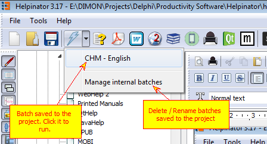

## Batch Compile

Clicking on toolbar icons to get output is time-consuming when you need multiple formats at once. That's why Helpinator allows you to create "batches" that consist of several "tasks". Each task allows to compile selected output format with pre-selected language and variable preset and then save it to the specified location.

You can save batches to external xml files or into the project itself. In the latter case you can access them with a drop-down on the main tool bar.

When you click the drop-down arrow a list of batches saved to the project appears. You can click on a batch in the list to run it instantly.

Click "Manage internal batches" to edit the list of batches saved to the project.

When you click "Batch Compile" icon with a lightning bolt "Batch Compile" dialog appears. It allows to create a batch by adding output tasks to it (double click on desirable output format in the list on the left), set output destination path, language and variable preset.

