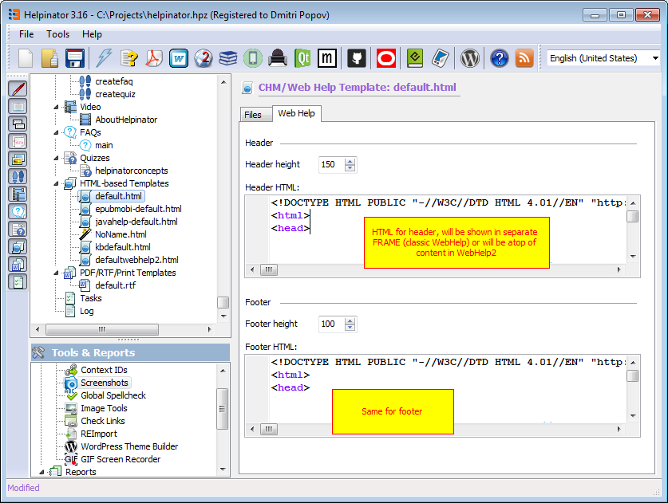

## HTML-based Templates

Each CHM/WebHelp template consists of two file groups:

1. Required files. Usually templates' main HTML page template and corresponding CSS file.
2. Additional files. Images used by template, scripts and etc.

In predefined templates there's jqueryui.zip file that contains JQuery UI theme for WebHelp (left pane with TOC, Index and Search). Inside it there's jqueryui.css and jqueryui.js files and "images" folder with images used by this theme.

HTML templates use several tags, enclosed in &#123;&#37;&#37;&#125;:

<table>
<tr><th>TRVTableCellData</th><th>TRVTableCellData</th></tr><tr><td>

<b>Tag</b>

</td><td>

<b>Meaning</b>

</td></tr><tr><td>

TITLE

</td><td>

Title of the current topic

</td></tr><tr><td>

BREADCRUMBS

</td><td>

Place for breadcrumbs links

</td></tr><tr><td>

PREVNEXTTOPIC

</td><td>

Links to previous and next topics, combined

</td></tr><tr><td>

PREVTOPIC

</td><td>

Link to previous topic

</td></tr><tr><td>

NEXTTOPIC

</td><td>

Link to next topic

</td></tr><tr><td>

PREVTOPIC_INCL

</td><td>

Link to previous topic, but instead of "Previous" text it uses HTML between this tag and END_PREVTOPIC_INCL tag.

</td></tr><tr><td>

NEXTTOPIC_INCL

</td><td>

Same as above but for next topic

</td></tr><tr><td>

SEEALSO

</td><td>

Lists related topics based on keywords match.

</td></tr></table>

You can also use project variables inside templates.

**Adapting WebHelp to your website**

You can also adapt WebHelp appearance to the style of your website using WebHelp header and footer. This fields are not required, if empty WebHelp will fill entire browser page. When filled, header and footer will appear in separate frames.

