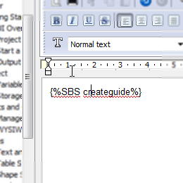

## How to use guides in topics

There's "Insert step-by-step guide" button on the topic editor toolbar.

Click on "Insert step-by-step guide" and select it from the drop-down list.

When you select a guide, guide placeholder appears in the editor area in the position of cursor.

