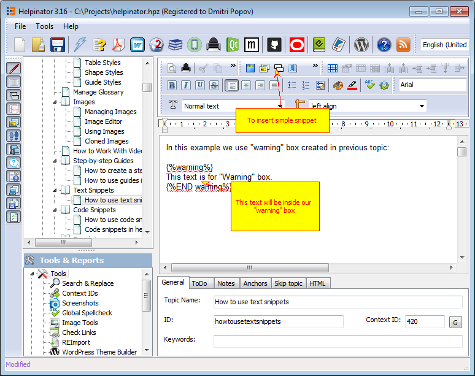

## How to use text snippets

In this example we use "warning" box created in previous topic:

<table>
<tr><td>

<b>Warning</b>

</td></tr><tr><td>

This text is for "Warning" box.

</td></tr></table>

How it will look like in CHM help file:

