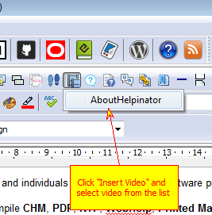

# How to Work With Video

From version 3.11 Helpinator allows you to embed video into topics. You can embed videos from video service providers like YouTube, Vimeo, DailyMotion or from local video files.

To start working with videos select "Video" node in the project tree view.

If there's no "Video" node click "Show Videos" on the tree view control bar on the left.

Video manager appears:

When you click "+" sign "Add from files" dialog appears. Click "Add files" to select one or more video files to add then click "OK".

When you click on YouTube sign "Add from URL" dialog appears:

To insert video placeholder into a topic click on video icon on the topic editor toolbar.

Helpinator inserts video placeholder in the position of caret. Now on compile time this placeholder will be replaced with your video.

Some formats like PDF or printed output do not support video. You can instruct Helpinator to replace video with a library image or a step-by-step guide via image properties.

