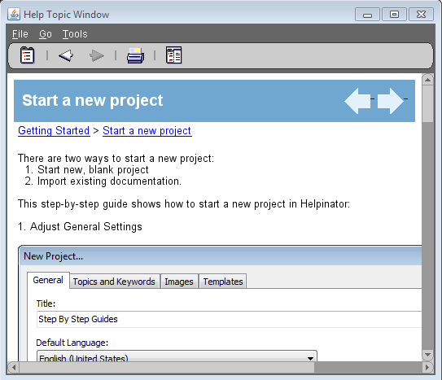

OracleHelp is a help system, developed by Oracle Inc. You can read more about it here:

[http://www.oracle.com/technetwork/topics/index-083946.html](http://www.oracle.com/technetwork/topics/index-083946.html "http://www.oracle.com/technetwork/topics/index-083946.html")

It consists of two parts:

OracleHelp for Java
OracleHelp for Web

Both parts use the same help file format (except Web version requires one more file) and Helpinator generates files that can be used with any of them.

To compile OracleHelp:

1. Download and install JDK

2. Download and extract OracleHelp SDK

[http://www.oracle.com/technetwork/developer-tools/help/utilsoft-ohw-422139.html](http://www.oracle.com/technetwork/developer-tools/help/utilsoft-ohw-422139.html "http://www.oracle.com/technetwork/developer-tools/help/utilsoft-ohw-422139.html")

3. Set Helpinator options

Now you can compile OracleHelp by clicking "Compile OracleHelp" button on the main toolbar.

Compiled OracleHelp looks like this.

Table of contents:

Topic view (undocked)

