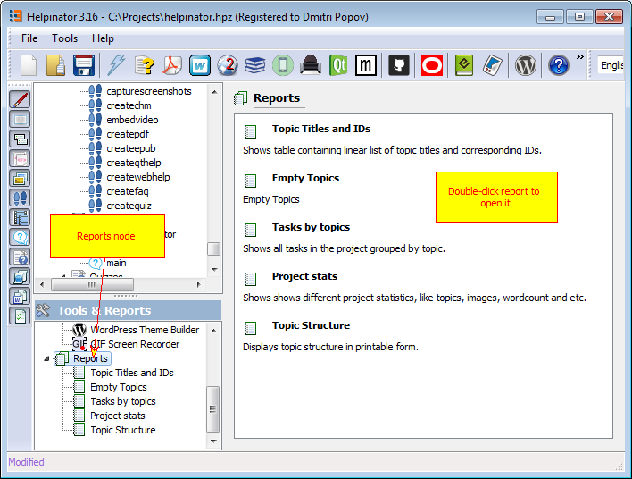
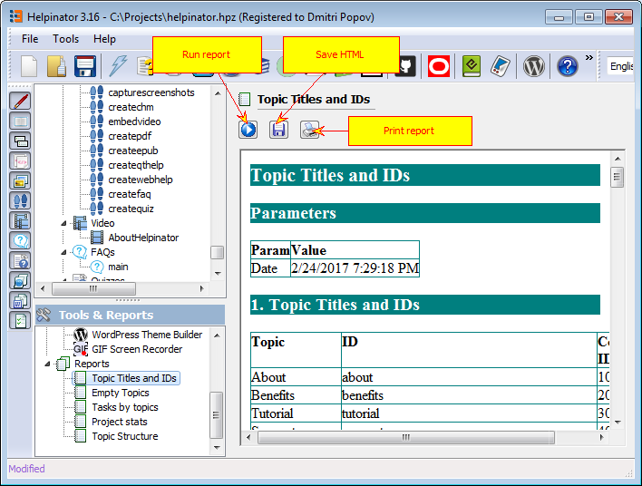

Reports allow you to get summary information about your project and save/print it.

Currently Helpinator has the following predefined reports:

**Topic titles and IDs** . Shows topic titles and corresponding Context IDs to reference specific topics from your app. Useful for communication between a tech writer and a developer.
**Empty topics** . Shows all empty topics in the project. Good to make sure all topics in your project have at least some text.
**Tasks by topics** . To manage tasks assigned to topics.
**Project stats** . Shows different project stats like number of topics, words and etc.
**Topic structure** . Prints topic tree.

