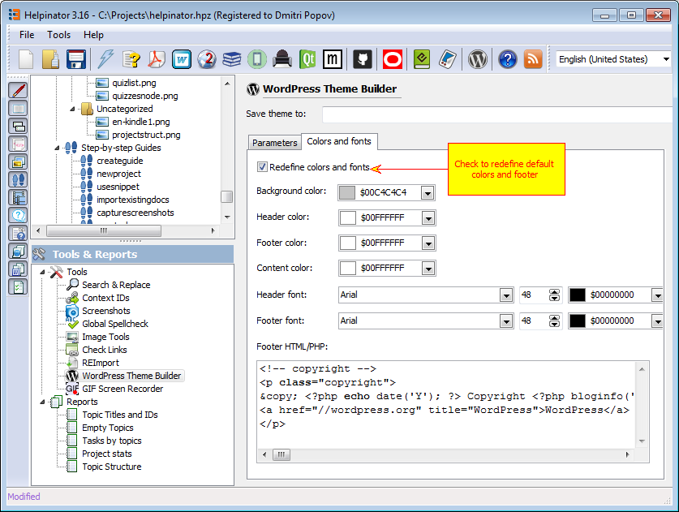

## WordPress Theme Builder

WordPress theme builder allows you to create a custom WordPress software documentation theme. The majority of WordPress themes do not suit software documentation well, Helpinator theme solves this problem. It makes your WordPress site look like a regular help file with tri-pane on the left featuring "Table Of Contents", "Index" and "Search" and content area on the right.

