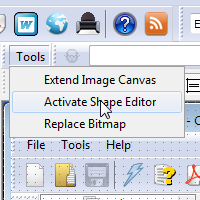

Helpinator has built-in image editor that allows you to add arrows, boxes with text and other useful content to images in the project's image library.

First you need to activate shape editor. It is disabled by default and all images go "as is".

Now editor is activated and you can choose shape style and add shapes to the screenshot.

