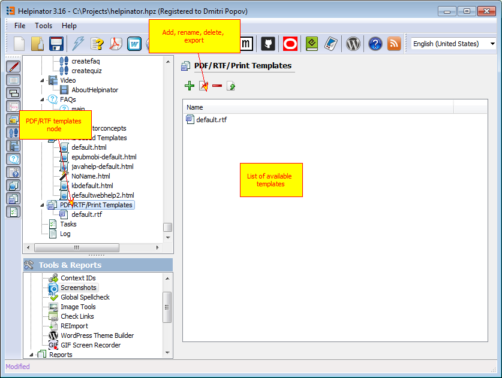
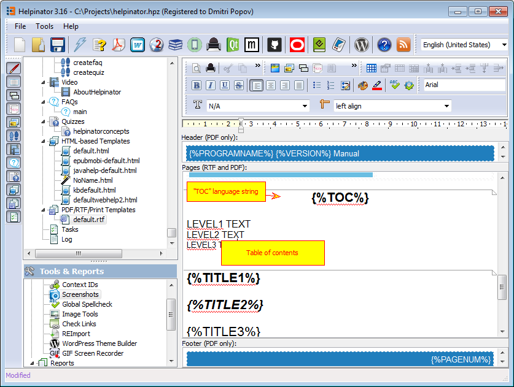

PDF/RTF/Print templates are generally RTF files with several reserved pages:

Cover page. Will be rendered without header and footer. Here you can place your logo and project title.
Table of contents page. Has a number of lines, starting with LEVEL and followed by number indicating for which sublevel this line should be used. Top level topics are level 1 and so on.
Topic template. Ususally has only TITLE and CONTENT tags, TITLE will be replaced by topic title and CONTENT with topic content.
Glossary template. Has templates for the first letter, term and definition.
Index page template. This page will list keywords and numbers of pages where they appear.

