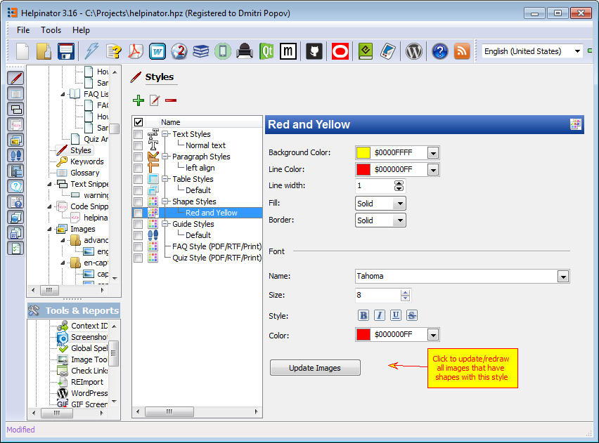

Shape styles allow you to define common settings for different shapes that you can add in the  [image editor](imageeditor.md "image editor") . You can select line styles, colors for lines and background and font settings for text inside shapes.

To use created style you can select it from the drop-down list in the image editor toolbar. This style will be used for shapes that you add. To change the style of the selected shape double-click it to open shape properties and select style in the dialog that appear.

