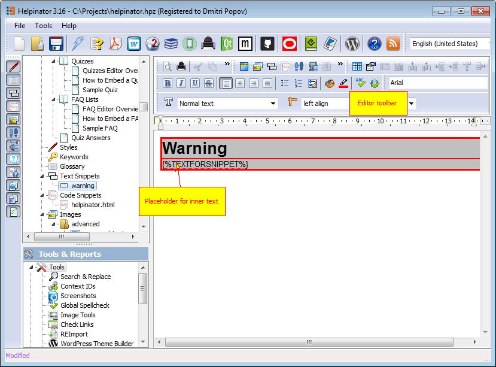

Text snippets are named reusable blocks of formatted text that you can create once and use in many topics. They are especially useful in creating/managing different kinds of sidebars in your topics.

The picture below shows how to manage text snippets.

There are two types of text snippets:

Simple pieces of formatted text
Parameterized snippets, that contain special placeholder TEXTFORSNIPPET which Helpinator replaces with text from the topic.

Here's an example of the second type text snippet:

